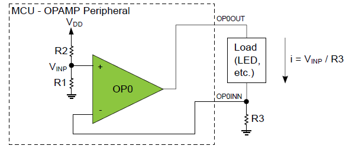

<!-- Please do not change this html logo with link -->

# AVR128DB48 Constant-Current Driver Using the Analog Signal Conditioning (OPAMP) Peripheral

  

<!-- This is where the introduction to the example goes, including mentioning the peripherals used -->
A new feature introduced in the AVR-DB is the Analog Signal Conditioning (OPAMP) peripheral. In this example, the OPAMP is used as a constant-current driver using a single external resistor. It can be used to drive electronic components such as LEDs, with constant current and not constant voltage. The OPAMP peripheral also provides the ability to adjust the current setting under firmware control. The configuration for this example can be seen in the figure above. For more information about setup and code, see the application note.

## Related Documentation

<!-- Any information about an application note or tech brief can be linked here. Use unbreakable links!
     In addition a link to the device family landing page and relevant peripheral pages as well:
     - [AN3381 - Brushless DC Fan Speed Control Using Temperature Input and Tachometer Feedback](https://microchip.com/00003381/)
     - [PIC18F-Q10 Family Product Page](https://www.microchip.com/design-centers/8-bit/pic-mcus/device-selection/pic18f-q10-product-family) -->
* [Constant-Current Driver Using the Analog Signal Conditioning (OPAMP) Peripheral Application Note](https://microchip.com/DSxxxxxxxxxx) <!--fill in DS number once it has been assigned-->
* [AVR128DB48 landing page](https://www.microchip.com/wwwproducts/en/AVR128DB48)

## Software Used

<!-- All software used in this example must be listed here. Use unbreakable links!
     - MPLAB® X IDE 5.30 or newer [(microchip.com/mplab/mplab-x-ide)](http://www.microchip.com/mplab/mplab-x-ide)
     - MPLAB® XC8 2.10 or a newer compiler [(microchip.com/mplab/compilers)](http://www.microchip.com/mplab/compilers)
     - MPLAB® Code Configurator (MCC) 3.95.0 or newer [(microchip.com/mplab/mplab-code-configurator)](https://www.microchip.com/mplab/mplab-code-configurator)
     - MPLAB® Code Configurator (MCC) Device Libraries PIC10 / PIC12 / PIC16 / PIC18 MCUs [(microchip.com/mplab/mplab-code-configurator)](https://www.microchip.com/mplab/mplab-code-configurator)
     - Microchip PIC18F-Q Series Device Support (1.4.109) or newer [(packs.download.microchip.com/)](https://packs.download.microchip.com/) -->
* [Atmel Studio 7.0.2397 or later](https://www.microchip.com/mplab/avr-support/atmel-studio-7)
* Atmel Studio AVR-DB_DFP version 1.0.21 or above
  
## Hardware Used

<!-- All hardware used in this example must be listed here. Use unbreakable links!
     - PIC18F47Q10 Curiosity Nano [(DM182029)](https://www.microchip.com/Developmenttools/ProductDetails/DM182029)
     - Curiosity Nano Base for Click boards™ [(AC164162)](https://www.microchip.com/Developmenttools/ProductDetails/AC164162)
     - POT Click board™ [(MIKROE-3402)](https://www.mikroe.com/pot-click) -->
* [AVR128DB48 Curiosity Nano](https://www.microchip.com/wwwproducts/en/AVR128DB48) <!-- Not the correct link, fix when curiosity nano page exists-->
* One resistor
* Load (LED, etc)

## Setup

<!-- Explain how to connect hardware and set up software. Depending on complexity, step-by-step instructions and/or tables and/or images can be used -->
* Connect the hardware together as seen in the schematic of the [application note](https://microchip.com/DSxxxxxxxxxx) <!--fill in DS number once it has been assigned-->

## Operation
* Connect the AVR128DB48 Curiosity Nano to a computer using a USB cable
* Download the zip file or clone the example to get the source code.
* Open the solution with Atmel Studio.
* Build the application and program the device.
* Press Start without debugging or use CTRL+ALT+F5 hotkeys to run the application.

<!-- Explain how to operate the example. Depending on complexity, step-by-step instructions and/or tables and/or images can be used -->

## Summary
This example provides the necessary code to set up the OPAMP peripheral as a constant current driver for a load. The value of the current is determined by an external resistor R3 and by selecting different voltage references internally for the OPAMP.
<!-- Summarize what the example has shown -->
